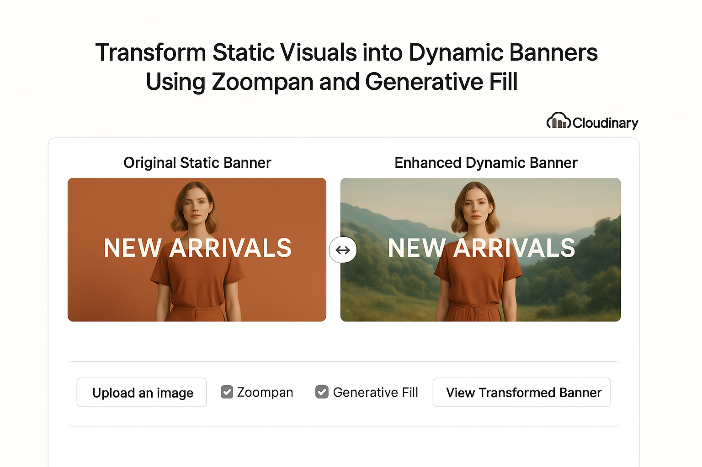

# 🌀 Zoompan Banners

> Transform and animate banners using AI generative fill and Ken Burns–style zoom effects.



---

## ✨ Features

- Upload banners directly to **Cloudinary**
- Generate smooth **Ken Burns zoompan animations**
- Use **AI-powered generative fill** for banner resizing
- Compare before/after with **interactive sliders**
- View recent uploads, side-by-side comparisons & download transformed images
- Backed by **Redis** for real-time uploads list
- Built with **Next.js 15**, **Tailwind CSS 4**, **shadcn/ui**, and **Motion.dev**

---

## 🛠 Built With

[](https://nextjs.org/)
[](https://cloudinary.com/)
[](https://tailwindcss.com/)
[](https://redis.io/)
[](./LICENSE)

---

## 📚 Table of Contents

- [Prerequisites](#prerequisites)
- [Local Setup](#local-setup)
- [.env Configuration](#env-configuration)
- [Available Scripts](#available-scripts)
- [Deployment](#deployment)
- [Useful Links](#useful-links)

---

## ✅ Prerequisites

- **Node.js 18+**

```bash
nvm install 20
nvm use 20
````

* A free [Cloudinary account](https://cloudinary.com/)
* A free [Redis Cloud](https://redis.com/redis-enterprise-cloud/overview/) instance

---

## 🚀 Local Setup

```bash
git clone https://github.com/yourname/zoompan-banners.git
cd zoompan-banners

npm install

cp .env.example .env.local
# → Fill in your Cloudinary & Redis credentials

npm run dev
# → Visit http://localhost:3000
```

---

## ⚙️ .env Configuration

Create a `.env.local` file with:

| Key                                 | Description                      |
| ----------------------------------- | -------------------------------- |
| `NEXT_PUBLIC_CLOUDINARY_CLOUD_NAME` | Your Cloudinary cloud name       |
| `NEXT_PUBLIC_CLOUDINARY_FOLDER`     | Folder to store all uploads      |
| `CLOUDINARY_API_KEY`                | Cloudinary API Key (server-only) |
| `CLOUDINARY_API_SECRET`             | Cloudinary Secret (server-only)  |
| `REDIS_URL`                         | Redis connection string          |

> ✅ `NEXT_PUBLIC_` values are safe for the browser — others are backend-only.

---

## 📜 Available Scripts

| Script          | Description                  |
| --------------- | ---------------------------- |
| `npm run dev`   | Start the dev server         |
| `npm run build` | Build for production         |
| `npm run lint`  | TypeScript and ESLint checks |
| `npm run start` | Start in production mode     |

---

## 🌍 Deployment

1. Push to GitHub
2. Import to [Vercel](https://vercel.com/)
3. Add the environment variables
4. Click **Deploy**

---

## 🔗 Useful Links

* 📸 [Cloudinary Zoompan](https://cloudinary.com/documentation/transformation_reference#e_zoompan)
* 🧠 [Generative Fill](https://cloudinary.com/documentation/generative_ai_transformations#generative_fill)
* 🎬 [Motion.dev](https://motion.dev)
* 🧰 [shadcn/ui](https://ui.shadcn.com)

---

**Make banners shine with motion and AI. ✨**
